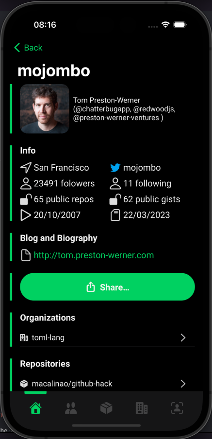

## Github App

### App
#### Video

#### Icon

#### Splash Screen

#### Home Screen

#### Users Screen

#### Users Screen: Searching

#### Repositories Screen

#### Repositories Screen: Searching

#### Organizations Screen

#### Profile Screen (able to implement in the future)

#### User Detail Screen

#### Repositories and Organizatoins in the User Detail Screen

#### Share link

#### Support to Light Mode

### Tools

For this challengue, I used the next tools:
- Xcode 14.2
- Swift 5
- [SwiftGen](https://github.com/SwiftGen/SwiftGen): To generate Swift Code for resources (images, localised strings, fonts and colors).
- [SwiftLint](https://github.com/realm/SwiftLint): To Clean Code.
- [SFSafeSymbols](https://github.com/SFSafeSymbols/SFSafeSymbols): To generate image since the Apple SF Symbols.

### Architecture: TCA

Also, I used the next architecture: [TCA](https://github.com/pointfreeco/swift-composable-architecture). The Composable Architecture (TCA, for short) is one of the newest architectures that arrived after native implementation of reactive programming in Swift (Combine) and the user interfaces programmatacaly (SwiftUI) solving problems of old architectures used in the market like MVVM, MVVM-C, and MVC.

### Modularization

For this project, I applied modularization for the different advantages (build time, development time, isolation of change, ...) of applying a non-monolithic project. In this project I used the next module structure:

- Core: In this module we have the basic structures like models.
- CoreUI: In this module we have the basic UI components.
- Network: I added the [Moya](https://github.com/Moya/Moya) dependency to implement the backend connection.
- Users-Repository: In this module we have the service related to GitHub users.
- Users-Repository-Live: In this module we have the dependency injection of the user service with mocking, failing and live data. I implement the live data to get real data from backend.
- Repos-Repository: In this module we have the service related to GitHub repositories.
- Repos-Repository-Live: In this module we have the dependency injection of the repository service with mocking, failing and live data. I implement the live data to get real data from backend.
- Orgs-Repository: In this module we have the service related to GitHub organizations.
- Orgs-Repository-Live: In this module we have the dependency injection of the organization service with mocking, failing and live data. I implement the live data to get real data from backend.
- Logged: This is the logged area.
- Unlogged: this is the unlogged area. In the future we can use bearer authentication with Moya to sign in with a user.
- Entry: That is the entry app module.

### Dependency Injection

We used dependency injection in this project because was necessary to use mock data simulating network connection. For that reason we used the default dependency injection of the TCA architecture: [Swift Dependencies](https://github.com/pointfreeco/swift-dependencies). Also with this package we can have dependency injection for the test and the previews in SwiftUI. Another advantage was when I implemented the Network module, it was easy to change the injection from **mockingz** to **live**.

For example, with failing injection we have the next screen:

### **Important**
- Due to time problems, I was unable to add the repository detail and organization detail screens. The endpoints were added, but only the screen was missing.
- I would also have liked to add the endpoints of the authenticated user in Moya. Only that was going to take more time. So I could also have added the Profile screen with this data.
- I left everything designed to add those screens mentioned before.
- A few things pending are adding unit tests with TCA, snapshot tests with the Point Free library and more UI tests.

I await your feedback. Thank you very much for the challenge!
